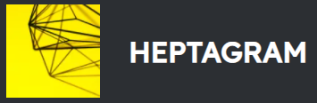

<h1>Heptagram Bot Website</h1>

Heptagram is the all-in-one, open-source Discord bot with the goal to be the single bot needed for any server.
 
No more music bot, mod bot, rules bot. Just Heptagram

Check out the website [here](https://heptagrambotproject.com/)

## 🤝 Contributing

Contributions, issues and feature requests are welcome! Feel free to check [issues page](https://github.com/Heptagram-Bot-Project-Project/website/issues). If you are interested in contributing, we ask that you take a look at the [contributing guide](https://github.com/Heptagram-Bot-Project-Project/bot/blob/master/CONTRIBUTING.md) before you contribute.

## 😎 Heptagram Team

### Owner

👤 **J-dogcoder**

-   GitHub: [@J-dogcoder](https://github.com/J-dogcoder)

### Head Website Developer

👤 **MidouWebDev**

-   GitHub: [@MidouWebDev](https://github.com/MidouWebDev)

## 🙏 Show your support

Give a ⭐️ if this project helped you!

## ✏ Discord Server

Heptagram has a community Discord server. You can join it at [https://discord.gg/pKmY7jsp4E](https://discord.gg/pKmY7jsp4E). In the server you can suggest features, talk with developers, and test out the bot for yourself. If you have made an Open Source Contribution, you can gain access to a special role and channels. To do so, join the server and then ping any admin and let them know.
